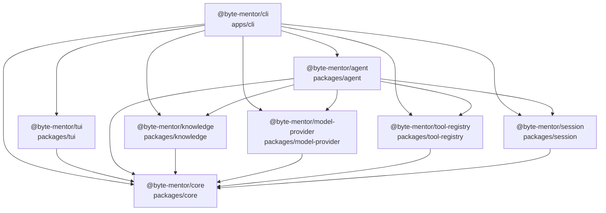

# Byte Mentor 架构设计结论

## 1. 文档原则

本文档记录 Byte Mentor 项目架构层面的设计结论。

尚未达成共识的内容先作为讨论项保留，不写成最终结论。

## 2. 当前架构判断

当前判断：Byte Mentor 需要自研一个轻量的 agent 基座，但不需要一开始实现完整通用版 openClaw。

这个基座会严格参考 nanobot 的 agent 架构来实现。

这里的“轻量 agent 基座”不是为了替代所有 agent 框架，而是为了给 Byte Mentor 提供一个稳定的教学运行时。

第一阶段基座应该是“教学场景专用的 agent runtime”，不是“通用自动化平台”。

## 3. 第一阶段运行入口

当前确定：Byte Mentor 第一阶段先做本地 CLI 形态，并提供 TUI 作为默认交互体验。

这里的 CLI 不是简单的一问一答脚本，而是本地教学 agent 的启动入口。它负责：

- 读取本地配置
- 创建或恢复教学会话
- 接收用户输入的学习目标
- 启动教学 agent runtime
- 展示教学过程中的流式输出、工具调用、状态变化和命令反馈

TUI 是 CLI 之上的交互外壳，不应该成为 agent 核心的一部分。

第一阶段可以复用 nanobot / openClaw 的 TUI 设计经验，尤其是：

- 本地 embedded runtime 模式
- 会话选择与恢复
- chat log
- 输入框
- 状态栏
- tool / progress 卡片
- slash command
- 流式输出拼接
- 错误、等待、运行中等状态展示

但 Byte Mentor 不应该直接让 TUI 驱动教学逻辑。正确边界是：

```text
TUI / CLI
  -> Command
  -> AgentLoop
  -> AgentRunner
  -> Provider / ToolRegistry / Knowledge / Session

Hook
  -> TUI / CLI event rendering
```

也就是说：

- TUI 负责显示和输入。
- CLI 负责进程入口、参数、配置和命令分发。
- AgentLoop 负责教学状态机。
- AgentRunner 负责模型与工具循环。
- Hook 负责把运行时事件传递给 TUI 展示。

这样后续如果需要改成 Web App、HTTP API 或其他聊天平台，不需要重写教学核心。

## 4. 技术栈选择

当前确定：Byte Mentor 第一阶段使用 TypeScript / Node.js 实现。

主要原因：

- 后续如果做 Web App，前端、后端和 agent runtime 可以共享类型定义。
- CLI / TUI / HTTP API 可以在同一套工程体系内演进。
- Tool schema、记忆数据结构、Teaching Brief、Observation Log 等核心结构适合用 TypeScript 类型稳定表达。
- 可以优先参考 openClaw 的 CLI / TUI / embedded runtime 形态，同时保留 Byte Mentor 自己的教学状态机和记忆模块。

## 5. Workspace 包拆分与 import 关系

当前确定：Byte Mentor 第一阶段采用 workspace package 边界拆分。

第一阶段包含 8 个 workspace project：

```text
apps/cli
packages/tui
packages/agent
packages/knowledge
packages/model-provider
packages/tool-registry
packages/session
packages/core
```

包名与职责如下：

- `@byte-mentor/cli`：本地应用入口，负责启动 CLI / TUI，并组装 agent runtime 需要的依赖。
- `@byte-mentor/tui`：终端交互界面，负责用户输入、聊天记录、状态栏、命令面板和运行事件渲染。
- `@byte-mentor/agent`：教学 agent runtime，负责教学状态机、上下文构建、模型调用循环、工具调用编排和运行事件产出。
- `@byte-mentor/knowledge`：知识子系统，负责 CatalogIndex、KnowledgeGraph、UserKnowledgeStatus、UserReadableNote、Teaching Brief 和 Graph Sync Plan。
- `@byte-mentor/model-provider`：模型供应商适配，负责把不同模型服务包装成统一调用接口。
- `@byte-mentor/tool-registry`：工具注册与执行，负责工具 schema 暴露、工具查找、工具调用和结果返回。
- `@byte-mentor/session`：会话存储与恢复，负责消息历史、会话元数据和本地持久化。
- `@byte-mentor/core`：共享契约和基础类型，负责跨包通用 ID、运行事件、命令协议、错误模型和基础接口。

`@byte-mentor/knowledge` 不命名为 `memory`。

原因是 Byte Mentor 的知识子系统不是常规 agent memory。它不只是聊天历史、摘要、向量检索或长期文件记忆，而是同时包含全局知识图谱、用户知识状态、用户可读笔记、Teaching Brief 生成和会话结束后的学习状态写回。

import 关系图如下。

箭头含义：

```text
A --> B 表示 A 可以 import B
```



关键约束：

- `@byte-mentor/tui` 不 import `@byte-mentor/agent`。
- `@byte-mentor/tui` 不 import `@byte-mentor/knowledge`。
- `@byte-mentor/knowledge` 不 import `@byte-mentor/agent`。
- `@byte-mentor/knowledge` 不 import `@byte-mentor/tui`。
- `@byte-mentor/model-provider` 不 import `@byte-mentor/agent`。
- `@byte-mentor/tool-registry` 不 import `@byte-mentor/agent`。
- `@byte-mentor/session` 不 import `@byte-mentor/agent`。
- `@byte-mentor/core` 不 import 任何本地业务包。

`@byte-mentor/cli` 可以依赖多个包，因为它是本地应用组装层。

## 6. 第一阶段需要实现的基座模块

Byte Mentor 第一阶段需要实现以下 agent 基座模块：

```text
CliEntry
TuiApp
AgentLoop
AgentRunner
Provider
ToolRegistry
Session
ContextBuilder
Knowledge
Compact
Hook
Command
Skill
```

模块职责初步划分如下：

- `CliEntry`：负责本地命令入口、参数解析、配置读取和启动 TUI / 非 TUI 模式。
- `TuiApp`：负责终端交互界面，包括输入、输出、状态栏、会话选择、命令面板和运行事件渲染。
- `AgentLoop`：负责一次教学会话 turn 的产品层状态机。
- `AgentRunner`：负责底层 LLM / tool calling 循环。
- `Provider`：负责模型供应商适配，向上提供统一模型调用接口。
- `ToolRegistry`：负责工具注册、工具 schema 暴露和工具执行。
- `Session`：负责会话隔离、消息历史、会话元数据和持久化。
- `ContextBuilder`：负责构建进入模型的 system prompt、历史、运行时上下文和教学上下文。
- `Knowledge`：负责知识子系统接入，包括 Teaching Brief 生成、定点查询、Observation Log 记录和会话结束写回。
- `Compact`：负责会话历史压缩和上下文窗口管理。
- `Hook`：负责 agent 生命周期事件、流式输出、进度事件和调试观测。
- `Command`：负责显式命令，例如新会话、清理、切换配置等。
- `Skill`：负责加载教学能力、工具使用说明和可复用工作流。

## 7. Knowledge 子系统边界

Knowledge 是 Byte Mentor 的核心子系统，不会完全按照 nanobot 的 memory 实现。

nanobot 的 memory 更偏向：

- 文件型长期记忆
- 会话历史归档
- 压缩摘要
- 后台整理

Byte Mentor 的 Knowledge 子系统则以知识图谱和用户知识状态为核心。

因此，知识图谱不是 agent 基座内部的普通工具，也不是简单的聊天记录摘要。

它是 Knowledge 子系统的一部分，并通过稳定接口接入 agent 基座。

Knowledge 子系统内部继续按照 `memory-requirements.md` 中确定的结构推进：

```text
Knowledge Subsystem
  -> CatalogIndex
  -> KnowledgeGraph
  -> UserKnowledgeStatus
  -> UserReadableNote
  -> Teaching Brief Builder
  -> Graph Sync Plan
```

agent 基座只依赖 Knowledge 子系统暴露出的能力，例如：

- 会话开始前生成 Teaching Brief
- 会话中按需定点查询记忆
- 会话中记录 Observation Log
- 会话结束后触发记忆写回

## 8. 初始运行链路

实现边界先收敛为：

```text
输入学习目标
  -> 建立教学会话
  -> 调用 Knowledge 子系统生成 Teaching Brief
  -> 运行教学 agent
  -> 记录 Observation Log
  -> 会话结束后调用 Knowledge 子系统写回
```

## 9. 当前暂不处理

暂不处理：

- 多聊天平台接入
- 插件市场
- 后台定时自动化任务
- 多 agent 协作
- 复杂权限系统
- 远程部署和多租户
