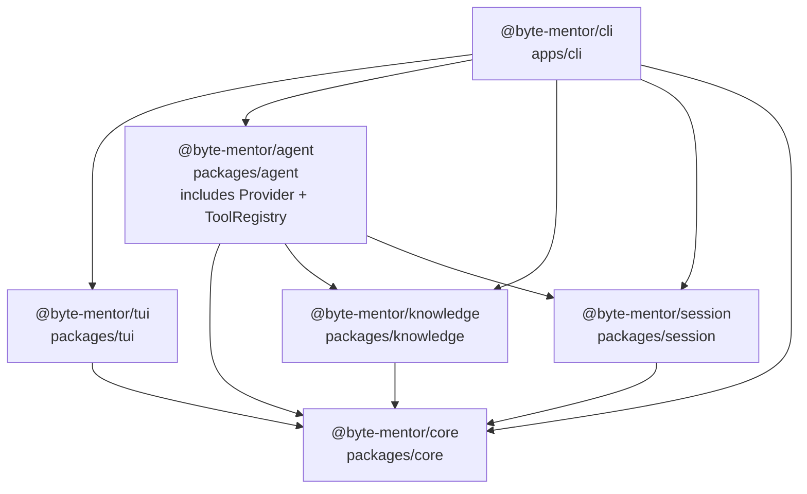
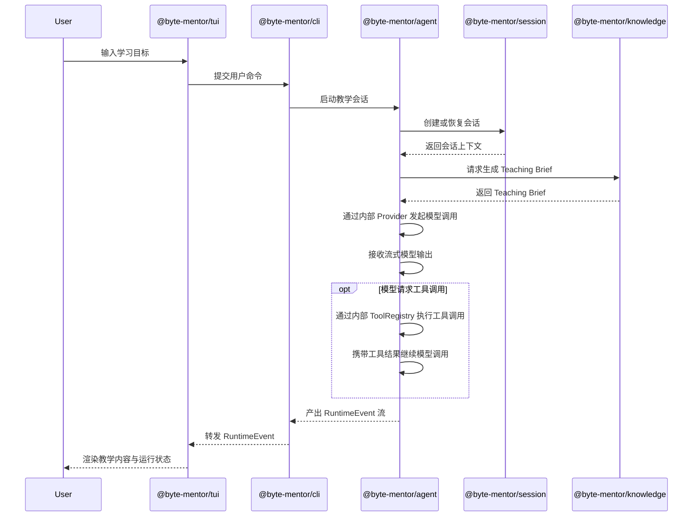
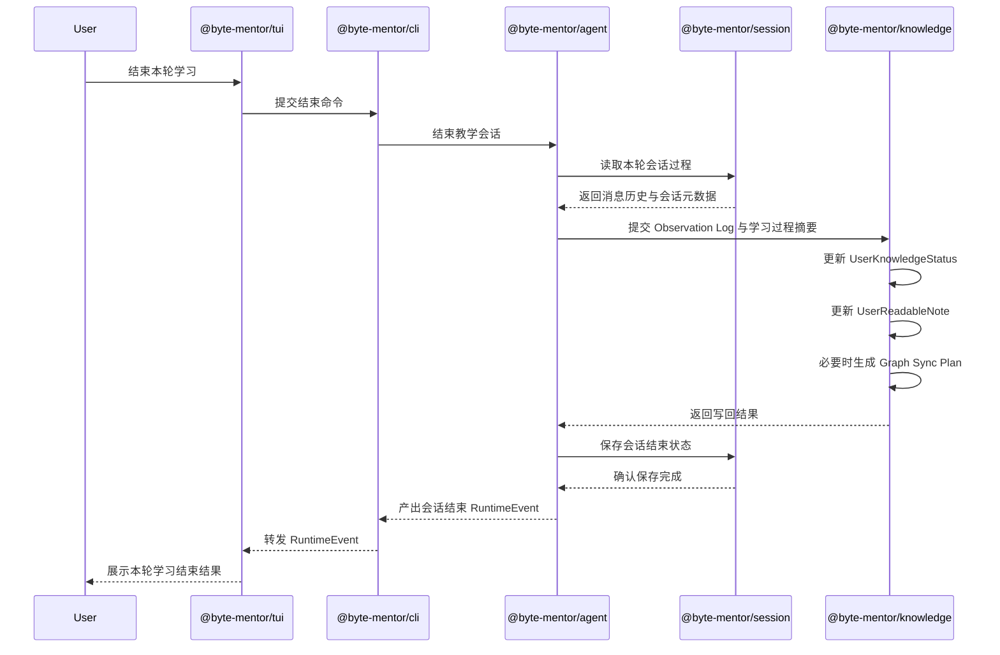

# Byte Mentor 架构设计结论

## 1. 文档原则

本文档记录 Byte Mentor 项目架构层面的设计结论。

尚未达成共识的内容先作为讨论项保留，不写成最终结论。

## 2. 当前架构判断

当前判断：Byte Mentor 需要自研一个轻量的 agent 基座，但不需要一开始实现完整通用版 openClaw。

这个基座会严格参考 nanobot 的 agent 架构来实现。

这里的“轻量 agent 基座”不是为了替代所有 agent 框架，而是为了给 Byte Mentor 提供一个稳定的教学运行时。

第一阶段基座应该是“教学场景专用的 agent runtime”，不是“通用自动化平台”。

## 3. 第一阶段运行入口

当前确定：Byte Mentor 第一阶段先做本地 CLI 形态，并提供 TUI 作为默认交互体验。

这里的 CLI 不是简单的一问一答脚本，而是本地教学 agent 的启动入口。它负责：

- 读取本地配置
- 创建或恢复教学会话
- 接收用户输入的学习目标
- 启动教学 agent runtime
- 展示教学过程中的流式输出、工具调用、状态变化和命令反馈

TUI 是 CLI 之上的交互外壳，不应该成为 agent 核心的一部分。

第一阶段可以复用 nanobot / openClaw 的 TUI 设计经验，尤其是：

- 本地 embedded runtime 模式
- 会话选择与恢复
- chat log
- 输入框
- 状态栏
- tool / progress 卡片
- slash command
- 流式输出拼接
- 错误、等待、运行中等状态展示

但 Byte Mentor 不应该直接让 TUI 驱动教学逻辑。正确边界是：

```text
TUI / CLI
  -> Command
  -> AgentLoop
  -> AgentRunner
  -> Knowledge / Session

AgentRunner
  -> Provider / ToolRegistry

Hook
  -> TUI / CLI event rendering
```

也就是说：

- TUI 负责显示和输入。
- CLI 负责进程入口、参数、配置和命令分发。
- AgentLoop 负责教学状态机。
- AgentRunner 负责模型与工具循环。
- Hook 负责把运行时事件传递给 TUI 展示。

这样后续如果需要改成 Web App、HTTP API 或其他聊天平台，不需要重写教学核心。

## 4. 技术栈选择

当前确定：Byte Mentor 第一阶段使用 TypeScript / Node.js 实现。

主要原因：

- 后续如果做 Web App，前端、后端和 agent runtime 可以共享类型定义。
- CLI / TUI / HTTP API 可以在同一套工程体系内演进。
- Tool schema、记忆数据结构、Teaching Brief、Observation Log 等核心结构适合用 TypeScript 类型稳定表达。
- 可以优先参考 openClaw 的 CLI / TUI / embedded runtime 形态，同时保留 Byte Mentor 自己的教学状态机和记忆模块。

第一阶段 Node.js 运行时基线使用 Node.js 22。

第一阶段模块系统使用 ESM。

工程初始化时：

- package 应显式使用 `"type": "module"`。
- TypeScript 应使用 Node ESM 语义对应的 module / moduleResolution 配置。
- 代码 import 规则应遵循 Node ESM 语义，避免依赖 CommonJS 专有写法。

第一阶段工程初始化使用 pnpm workspace。

pnpm 的职责是：

- 管理 workspace 内的多个 package。
- 管理本地 package 之间的 `workspace:*` 依赖。
- 运行根目录和各 package 的工程脚本。
- 帮助把 package import 边界落到工程结构中。

第一阶段 TypeScript 构建和检查使用 `tsc`。

`tsc` 的职责是：

- 对各 package 做类型检查。
- 将 TypeScript 编译成 JavaScript。
- 配合 TypeScript project references 理解多 package 之间的依赖顺序。

第一阶段使用 TypeScript project references 表达 package 编译依赖图。

它的作用是让 TypeScript 明确知道：

```text
cli -> agent -> knowledge -> core
cli -> session -> core
tui -> core
```

从而支持按依赖顺序构建、增量类型检查，以及更清楚的 package 边界。

第一阶段不引入 `tsup` 作为 package 打包工具。

原因是当前目标是建立本地 CLI 产品的最小可运行工程骨架，重点是 workspace 边界、类型检查和 CLI 启动链路，不是发布 npm package、生成多格式 bundle 或优化 package 分发产物。

后续当需要发布 package、输出更稳定的 `dist` 产物、同时支持 ESM / CJS，或需要更快的库打包流程时，再引入 `tsup`。

第一阶段加入 ESLint 和 Prettier。

ESLint 的职责是检查代码质量和潜在问题，例如未使用变量、不合理 import、容易出错的代码写法。

Prettier 的职责是统一代码格式，例如缩进、换行、引号和尾逗号。

ESLint 和 Prettier 的边界是：

- ESLint 负责代码质量规则。
- Prettier 负责代码格式规则。

格式问题不交给 ESLint 争论，代码质量问题不交给 Prettier 处理。

第一阶段加入 Vitest 作为测试运行器。

Vitest 的职责是：

- 查找并执行测试文件。
- 汇总测试通过和失败结果。
- 提供 watch 模式，支持开发过程中快速反馈。
- 支持 TypeScript 项目中的单元测试和轻量集成测试。

测试工具的作用不是替代类型检查，而是验证运行时行为。

TypeScript 负责回答：

```text
代码在类型层面是否成立？
```

Vitest 负责回答：

```text
代码在运行时行为上是否符合预期？
```

## 5. Workspace 包拆分与 import 关系

当前确定：Byte Mentor 第一阶段采用 workspace package 边界拆分。

第一阶段包含 6 个 workspace project：

```text
apps/cli
packages/tui
packages/agent
packages/knowledge
packages/session
packages/core
```

包名与职责如下：

- `@byte-mentor/cli`：本地应用入口，负责启动 CLI / TUI，并组装 agent runtime 需要的依赖。
- `@byte-mentor/tui`：终端交互界面，负责用户输入、聊天记录、状态栏、命令面板和运行事件渲染。
- `@byte-mentor/agent`：教学 agent runtime，负责教学状态机、上下文构建、模型调用循环、工具调用编排和运行事件产出。Provider 和 ToolRegistry 第一阶段作为该包的内部模块存在。
- `@byte-mentor/knowledge`：知识子系统，负责 CatalogIndex、KnowledgeGraph、UserKnowledgeStatus、UserReadableNote、Teaching Brief 和 Graph Sync Plan。
- `@byte-mentor/session`：会话存储与恢复，负责消息历史、会话元数据和本地持久化。
- `@byte-mentor/core`：共享契约和基础类型，负责跨包通用 ID、运行事件、命令协议、错误模型和基础接口。

Provider 和 ToolRegistry 不在第一阶段拆成独立 workspace package。

原因是它们当前主要服务 `@byte-mentor/agent` 内部的 AgentRunner：

- Provider 负责模型供应商适配。
- ToolRegistry 负责工具注册、工具 schema 暴露和工具执行。

当 Provider 或 ToolRegistry 需要被多个运行时、服务端入口或其他子系统复用时，再拆成独立 package。

`@byte-mentor/knowledge` 不命名为 `memory`。

原因是 Byte Mentor 的知识子系统不是常规 agent memory。它不只是聊天历史、摘要、向量检索或长期文件记忆，而是同时包含全局知识图谱、用户知识状态、用户可读笔记、Teaching Brief 生成和会话结束后的学习状态写回。

import 关系图如下。

箭头含义：

```text
A --> B 表示 A 可以 import B
```



关键约束：

- `@byte-mentor/tui` 不 import `@byte-mentor/agent`。
- `@byte-mentor/tui` 不 import `@byte-mentor/knowledge`。
- `@byte-mentor/knowledge` 不 import `@byte-mentor/agent`。
- `@byte-mentor/knowledge` 不 import `@byte-mentor/tui`。
- `@byte-mentor/session` 不 import `@byte-mentor/agent`。
- `@byte-mentor/core` 不 import 任何本地业务包。

`@byte-mentor/cli` 可以依赖多个包，因为它是本地应用组装层。

## 6. 职责边界原则

第一阶段只在架构层面确定包的职责边界，不提前固化具体数据模型和接口签名。

### 6.1 `@byte-mentor/cli`

`@byte-mentor/cli` 是本地应用组装层。

它负责：

- 启动本地 CLI / TUI。
- 读取启动参数和本地配置。
- 创建各个 package 的运行实例。
- 把 TUI、Agent、Knowledge、Session 连接起来。

它不负责：

- 教学状态机。
- 知识状态判断。
- 会话历史规则。
- 终端 UI 细节。

### 6.2 `@byte-mentor/tui`

`@byte-mentor/tui` 是终端交互层。

它负责：

- 接收用户输入。
- 展示聊天内容、运行状态、命令反馈和错误信息。
- 维护终端界面内部状态，例如输入框、滚动位置、展开折叠状态。

它不负责：

- 调用模型。
- 执行工具。
- 判断用户知识状态。
- 直接读写 Knowledge 子系统。
- 直接读写 Session 持久化。

### 6.3 `@byte-mentor/agent`

`@byte-mentor/agent` 是教学运行时。

它负责：

- 教学会话的运行状态机。
- 构建模型上下文。
- 调用内部 Provider 获取模型输出。
- 通过内部 ToolRegistry 执行工具调用。
- 根据教学过程产出运行事件。
- 在合适时机请求 Knowledge 子系统生成 Teaching Brief、记录观察和执行写回。
- 在合适时机请求 Session 读取或保存会话过程。

它不负责：

- 长期知识状态的事实维护。
- 知识图谱结构的内部更新规则。
- 用户可读笔记的正式写入规则。
- 终端界面渲染。
- 底层持久化格式。

### 6.4 `@byte-mentor/knowledge`

`@byte-mentor/knowledge` 是知识子系统。

它负责：

- CatalogIndex。
- KnowledgeGraph。
- UserKnowledgeStatus。
- UserReadableNote。
- Teaching Brief 生成。
- Observation Log 的知识语义处理。
- 会话结束后的学习状态写回。
- Graph Sync Plan。

它不负责：

- 模型调用循环。
- 工具执行循环。
- TUI 展示。
- 通用会话历史保存。
- CLI 启动和配置读取。

### 6.5 `@byte-mentor/session`

`@byte-mentor/session` 是会话存储与恢复层。

它负责：

- 会话创建和恢复。
- 消息历史保存。
- 会话元数据保存。
- 支持 agent runtime 恢复上下文。

它不负责：

- 判断用户是否掌握某个知识点。
- 生成 Teaching Brief。
- 更新 KnowledgeGraph。
- 渲染 UI。
- 调用模型或工具。

### 6.6 `@byte-mentor/core`

`@byte-mentor/core` 是跨包共享契约层。

它负责：

- 跨包通用 ID 类型。
- 跨包运行事件协议。
- 跨包命令协议。
- 通用错误模型。
- 基础接口，例如日志、时钟、取消信号等。

它不负责：

- 教学业务逻辑。
- Knowledge 业务规则。
- Session 存储规则。
- TUI 渲染。
- Provider 或 ToolRegistry 的具体实现。

`@byte-mentor/core` 必须保持薄层。任何无法确定归属的业务逻辑，不应该因为“多个包可能会用”而直接放入 `core`。

## 7. 第一阶段需要实现的基座模块

Byte Mentor 第一阶段需要实现以下 agent 基座模块：

```text
CliEntry
TuiApp
AgentLoop
AgentRunner
Provider
ToolRegistry
Session
ContextBuilder
Knowledge
Compact
Hook
Command
Skill
```

模块职责初步划分如下：

- `CliEntry`：负责本地命令入口、参数解析、配置读取和启动 TUI / 非 TUI 模式。
- `TuiApp`：负责终端交互界面，包括输入、输出、状态栏、会话选择、命令面板和运行事件渲染。
- `AgentLoop`：负责一次教学会话 turn 的产品层状态机。
- `AgentRunner`：负责底层 LLM / tool calling 循环。
- `Provider`：负责模型供应商适配，向上提供统一模型调用接口；第一阶段属于 `@byte-mentor/agent` 内部模块。
- `ToolRegistry`：负责工具注册、工具 schema 暴露和工具执行；第一阶段属于 `@byte-mentor/agent` 内部模块。
- `Session`：负责会话隔离、消息历史、会话元数据和持久化。
- `ContextBuilder`：负责构建进入模型的 system prompt、历史、运行时上下文和教学上下文。
- `Knowledge`：负责知识子系统接入，包括 Teaching Brief 生成、定点查询、Observation Log 记录和会话结束写回。
- `Compact`：负责会话历史压缩和上下文窗口管理。
- `Hook`：负责 agent 生命周期事件、流式输出、进度事件和调试观测。
- `Command`：负责显式命令，例如新会话、清理、切换配置等。
- `Skill`：负责加载教学能力、工具使用说明和可复用工作流。

## 8. Knowledge 子系统边界

Knowledge 是 Byte Mentor 的核心子系统，不会完全按照 nanobot 的 memory 实现。

nanobot 的 memory 更偏向：

- 文件型长期记忆
- 会话历史归档
- 压缩摘要
- 后台整理

Byte Mentor 的 Knowledge 子系统则以知识图谱和用户知识状态为核心。

因此，知识图谱不是 agent 基座内部的普通工具，也不是简单的聊天记录摘要。

它是 Knowledge 子系统的一部分，并通过稳定接口接入 agent 基座。

Knowledge 子系统内部继续按照 `memory-requirements.md` 中确定的结构推进：

```text
Knowledge Subsystem
  -> CatalogIndex
  -> KnowledgeGraph
  -> UserKnowledgeStatus
  -> UserReadableNote
  -> Teaching Brief Builder
  -> Graph Sync Plan
```

agent 基座只依赖 Knowledge 子系统暴露出的能力，例如：

- 会话开始前生成 Teaching Brief
- 会话中按需定点查询记忆
- 会话中记录 Observation Log
- 会话结束后触发记忆写回

## 9. 初始运行链路

实现边界先收敛为：

```text
输入学习目标
  -> 建立教学会话
  -> 调用 Knowledge 子系统生成 Teaching Brief
  -> 运行教学 agent
  -> 记录 Observation Log
  -> 会话结束后调用 Knowledge 子系统写回
```

### 9.1 学习会话启动时序图



### 9.2 会话结束写回时序图



## 10. 当前暂不处理

暂不处理：

- 多聊天平台接入
- 插件市场
- 后台定时自动化任务
- 多 agent 协作
- 复杂权限系统
- 远程部署和多租户
